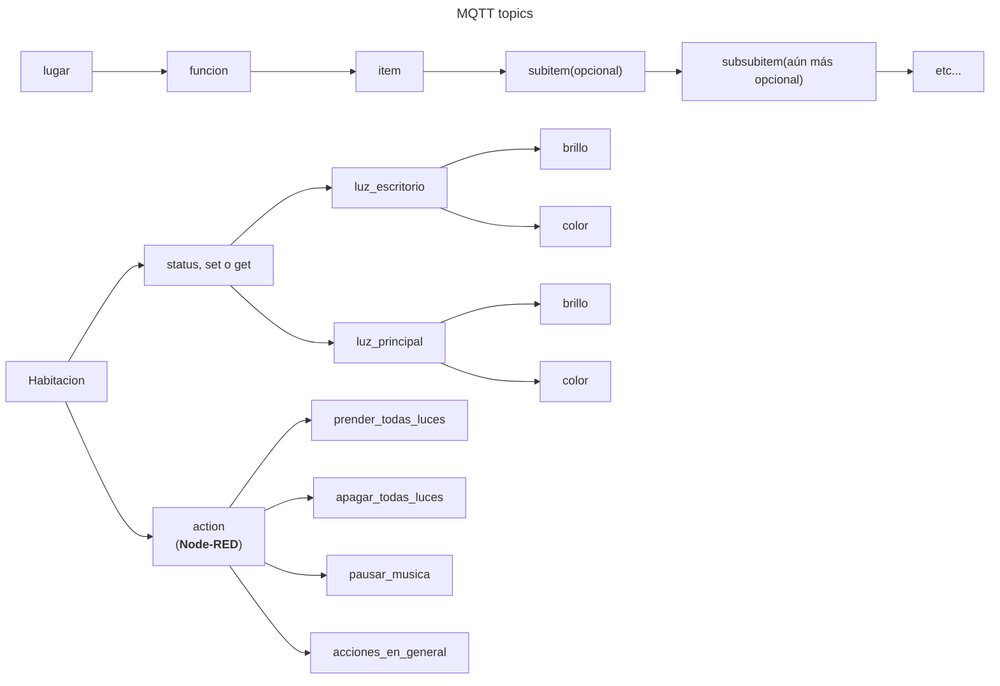
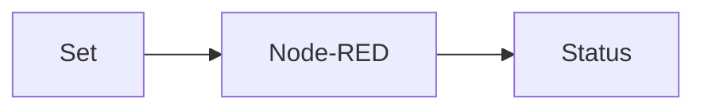
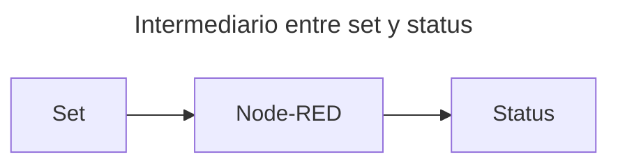
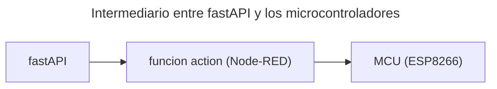

# Sensorhouse

Un proyecto en el cual uso una serie de ESP8266 para comunicarse con un broker MQTT.
El proyecto usa Node-RED como middleware entre los microcontroladores y la API de FastAPI

## Grafico de topicos MQTT

### Lugar:
Es la representación del lugar físico del cual se está hablando. Si no hay un lugar específico, `lugar` debe ser `general`

### Funcion
Es la función a ejecutar

#### Status

A esta función se publica el estado actual del item.
Por ejemplo, se subscribe a para conocer la temperatura `habitacion/status/temperatura`

#### Set

A esta funcion se publica el estado que se desea setear
Por ejemplo, si se quiere publicar la lectura de temperatura actual de la habitación, se debe usar el tópico `habitacion/set/temperatura`.

**Aca se usa de intermediario Node-RED**, de la siguiente forma

Node-RED define que valores son válidos y cuales no (por ejemplo, filtra que se publique que la temperatura actual es -3627 grados, ya que eso no es posible, y si fuera posible, estaríamos todos muertos)

Esto es para filtrar posibles valores incorrectos, y que no vaya información basura a status

#### Get

Una funcion especial, para "pedir" una actualización de status

### Item

La cosa de la que se está hablando.
Por ejemplo, en `habitacion/status/temperatura`, `temperatura` es el item

Puede tener subitems, por ejemplo, `habitacion/status/luz/brillo` o `habitacion/status/luz/color`

## Cuál es la funcion de Node-RED

La idea es que Node-RED funcione de intermediario para dos cosas:

### Intermediario entre set y status

Node-RED define que valores son válidos y cuales no (por ejemplo, filtra que se publique que la temperatura actual es -3627 grados, ya que eso no es posible, y si fuera posible, estaríamos todos muertos)

Esto es para filtrar posibles valores incorrectos, y que no vaya información basura a status

### Intermediario entre fastAPI y los microcontroladores usando el tópico actions

Hay una funcion llamada actions, a la que fastAPI publica, que sirve como "fachada".

Por ejemplo, si fastAPI publica a `habitacion/actions/prender_todas_luces`, Node-RED lee ese tópico y actúa de intermediario, publicando `brillo = 100` en todas las luces.

